# 2ο Γυμνάσιο Χανίων - 5oς Πανελλήνιος Διαγωνισμός Ανοιχτών Τεχνολογιών

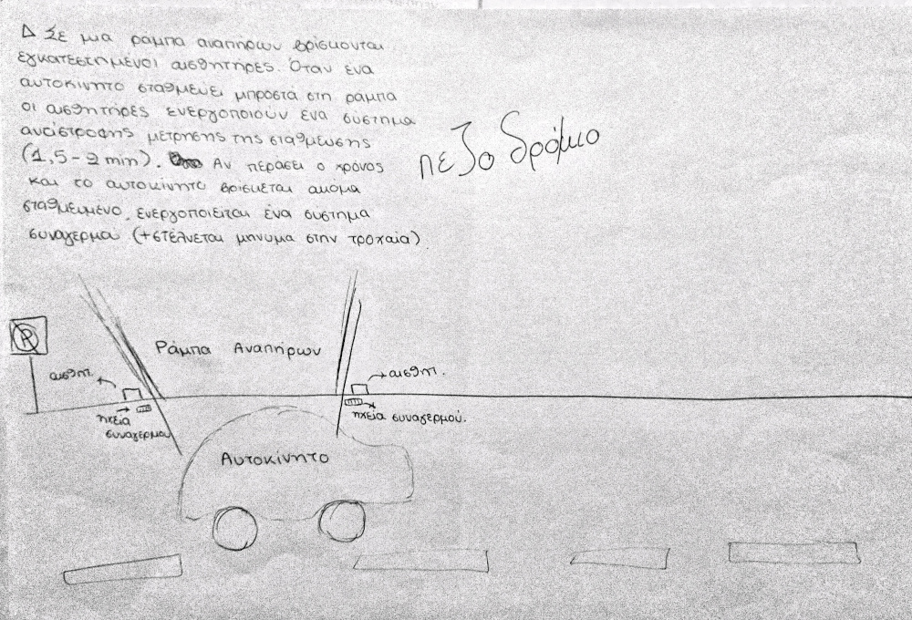

*Το ρομπότ Wheel Alert - πρωτότυπο σχέδιο*

## Wheel Alert - ρομπότ επιτήρησης των δαπέδων ήπιας κλήσης για ΑΜΕΑ

## Έρευνα και σχεδίαση ##

### Αρχική ιδέα
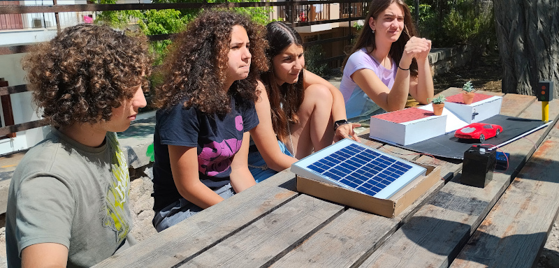

*Η ομάδα ρομποτικής του 2ου Γυμνασίου Χανίων και το πρωτότυπο ρομπότ Wheel Alert.*

Μια από τις ιδέες πριν τη σχεδίαση του ρομπότ περιγράφεται από το παρακάτω κείμενο μαθητή, μέλους της ομάδας Ρομποτικής του 2ου Γυμνασίου Χανίων:

*"Σε μία ράμπα αναπήρων βρίσκονται εγκατεστημένοι δύο ή τέσσερις αισθητήρες. Όταν ένα αυτοκίνητο σταθμεύει μπροστά στη ράμπα οι αισθητήρες ενεργοποιούν ένα σύστημα αντίστροφης μέτρησης της στάθμευσης (1,5 με 2 λεπτά). Αν περάσει ο χρόνος και το αυτοκίνητο βρίσκεται ακόμα σταθμευμένο ενεργοποιείται ένα σύστημα συναγερμού. Παράλληλα στέλνεται μήνυμα στην τροχαία."*

Το ρομποτικό σύστημα Wheel Alert θα είναι ενεργειακά αυτόνομο και σύμφωνο με τους όρους της Πράσινης Οικονομίας Ανοιχτής και Ίσης για Όλους, καθώς θα διαθέτει ηλιακό συλλέκτη, συσσωρευτή ηλεκτρικής ενέργειας και σύστημα διαχείρισης της ηλεκτρικής ενέργειας.

### Πράσινη οικονομία, Ανοιχτή και Ίση για Όλους
 Η ιδέα του *Wheel Alert* καλύπτει τη θεματική κατηγορία του διαγωνισμού επειδή σχετίζεται με:
* εξοικονόμηση ενέργειας (σύστημα διαχείρισης ηλεκτρικής ενέργειας του Wheel Alert),
* ενίσχυση της κοινωνικής ισότητας (διευκόλυνση της καθημερινότητας των ΑΜΕΑ),
* πράσινη παραγωγή ενέργειας (ηλιακός συλλέκτης του Wheel Alert),
* μέσα μεταφοράς (το ρομπότ αφορά δάπεδα απαλής κλήσης για ΑΜΕΑ και οχήματα πόλης),
* πράσινη μετακίνηση (το ρομπότ αφορά δάπεδα απαλής κλήσης για ΑΜΕΑ και οχήματα πόλης) και
* πράσινη κουλτούρα και κοινωνική ευαισθησία (ηλιακή ενέργεια και διαφύλαξη των δικαιωμάτων των ΑΜΕΑ).

Εντός των παρενθέσεων αναφέρονται η σχέση με τα εξαρτήματα και τις δυνατότητες του ρομπότ.

### Ανοιχτή αρχιτεκτονική
Για την κατασκευή του ρομπότ χρησιμοποιήθηκαν, αποκλειστικά, λογισμικό και υλικό ανοιχτής αρχιτεκτονικής: 
- ο ελεγκτής του ρομπότ είναι ο διάσημος Arduino Uno.
- Το λογισμικό του ρομπότ αναπτύχθηκε με τη βοήθεια του προγραμματιστικού περιβάλλοντος Arduino IDE.

Τα σχέδια, ο αλγόριθμος, το πρόγραμμα και όλο το σχετικό υλικό του *Wheel Alert* διανέμονται με την άδεια ανοιχτής αρχιτεκτονικής [GPL-3.0](https://github.com/2o-gymnasio-chania/2023_openedtech_competition/blob/main/LICENSE).

### Μελέτη υπάρχουσας κατάστασης ###
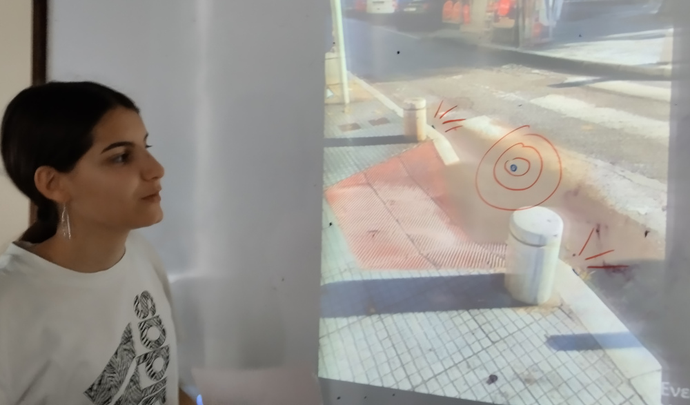

*Προβληματισμοί κατά την αρχική φάση της σχεδίασης*

Τις σύγχρονες Ελληνικές πόλεις βασανίζει το πρόβλημα της παράνομης στάθμευσης. Το πρόβλημα αυτό επηρεάζει αρνητικά την καθημερινότητα των ΑΜΕΑ στο αστικό περιβάλλον. Μια από τις συνήθεις μορφές του προβλήματος είναι η παράνομη στάθμευση οχημάτων στα δάπεδα ήπιας κλήσης. Ως αποτέλεσμα της παράνομης αυτής συνήθειας των οδηγών προκύπτει η αδυναμία πρόσβασης των ΑΜΕΑ και ιδιαίτερα των ανθρώπων που κινούνται σε αμαξίδιο, στα πεζοδρόμια και στις συνήθεις διαδρομές στο κέντρο των πόλεων. Το πρόβλημα, κυρίως,  οφείλεται στην ελλειπή εκπαίδευση των οδηγών και στην ελλιπή αστυνόμευση. Το ρομπότ *Wheel Alert* θα προσπαθήσει να μετριάσει το πρόβλημα της ελλιπούς επιτήρησης και αστυνόμευσης. Είναι κατάλληλα κατασκευασμένο και προγραμματισμένο ώστε να επιτηρεί την περιοχή του διαδρόμου ήπιας κλήσης. Με ένα κόστος κατασκευής περίπου στα 100€, το *Wheel Alert* αντικαθιστά αξιόπιστα την ανθρώπινη επίβλεψη χωρίς κόστος λειτουργίας. Παράγει έναν οξύ και ενοχλητικό ήχο, όποτε ένα όχημα εμποδίζει την κίνηση στα δάπεδα ήπιας κλήσης. Έτσι θα στιγματίζει τον ασυνείδητο οδηγό και θα προκαλεί το κοινό αίσθημα στους παρευρισκόμενους πολίτες. Στοχεύεται έτσι η ευαισθητοποίηση τόσο των οδηγών των οχημάτων, όσο και των πεζών, που με αφορμή τους ήχους του ρομπότ μπορεί να αποτρέψουν την παράνομη στάθμευση με πιθανές επεμβάσεις τους και συμβουλές προς τους οδηγούς.

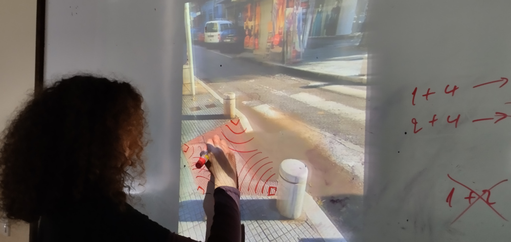

*Προβληματισμοί κατά την αρχική φάση της σχεδίασης*

### Ορισμός του προβλήματος ###
Με τη βοήθεια του ρομπότ *Wheel Alert* μπορούν να αντιμετωπιστούν τα παρακάτω προβλήματα:
- παράνομη στάθμευση
- εμπόδια στην κίνηση των ΑΜΕΑ εντός του αστικού περιβάλλοντος
- αποδοτική διαχείριση της ενέργειας
- ρυπογόνος ενέργεια

### Εναλλακτικές προτάσεις ###
Το 2ο Γυμνάσιο Χανίων συμμετέχει στον 5ο διαγωνισμό με τη θεματική κατηγορία *Πράσινη οικονομία, Ανοιχτή και Ίση για Όλους*. Αρχικά υπήρχε έντονος προβληματισμός στην ομάδα για την επιλογή του θέματος και της ιδέας που θα οδηγούσε στην κατασκευή του ρομπότ. Η φαντασία των μελών της ομάδας και η εμπειρία της από τις συμμετοχές στους προηγούμενους διαγωνισμούς στήριξαν την υποβολή πολλών εναλλακτικών προτάσεων, με πολύ ενδιαφέρουσες δυνατότητες που σχετίζονται με την πράσινη οικονομία.

Τα παρακάτω κείμενα αναφέρονται σε εναλλακτικές ιδέες. Παρουσιάζονται όπως ακριβώς τα καταθέσαν οι μαθήτριες και οι μαθητές, ως μέλη της ομάδας εργασίας του 2ου Γυμνασίου Χανίων για το διαγωνισμό ρομποτικής.

- **Τριβή και ταχύτητα**: *"Η εγκατάσταση αυτή εκμεταλλεύεται την τριβή που δημιουργείται από τα αυτοκίνητα. Τοποθετημένη σε ένα κεντρικό δρόμο μπροστά από μία στάση λεωφορείων, τα αυτοκίνητα περνάνε από πάνω της και δημιουργείται τριβή και συσσωρεύεται θερμική ενέργεια. Αυτή η ενέργεια μετατρέπεται από έναν συλλέκτη ενέργειας στην άκρη του δρόμου. Έτσι, μία μεγάλη ποσότητα ενέργειας μπορεί να χρησιμοποιηθεί για να τροφοδοτηθούν πολλές συσκευές μέσω φορτιστών οι οποίοι θα είναι τοποθετημένοι στη στάση."*

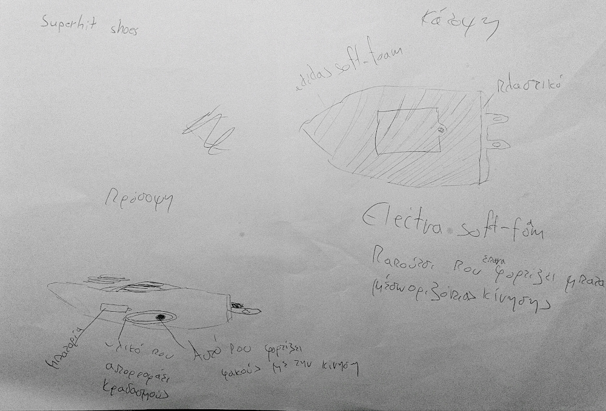

*Παπούτσια που λειτουργούν ως φορτιστής - πρωτότυπο σχέδιο*

- **Παπούτσια φορτιστής**: *Παπούτσι που φορτίζει μπαταρίες μέσω οριζόντιας κίνησης δηλαδή με το περπάτημα.*
- **Μετατροπέας της δύναμης του νερού σε ηλεκτρική ενέργεια**: *"Εάν μπορούσαμε να μετατρέψουμε τη δύναμη με την οποία πέφτει το νερό σε ηλεκτρική ενέργεια τότε θα μπορούσαμε να εξοικονομήσουμε μεγάλη ποσότητα ηλεκτρισμού. Θα μπορούσαμε να κάνουμε ένα τεχνητό καταρράκτη και το νερό το οποίο θα πέφτει από ένα ύψος περίπου 10 με 15 μέτρα να καταλήγει σε έναν συλλέκτη ενέργειας και ηλεκτρική ενέργεια που θα δημιουργείται να χρησιμοποιείται για την απαραίτητη ηλεκτρική ενέργεια μιας περιοχής. Το νερό έπειτα θα μπορούσε να αποβάλλεται ή να συλλέγεται για άλλη χρήση."*

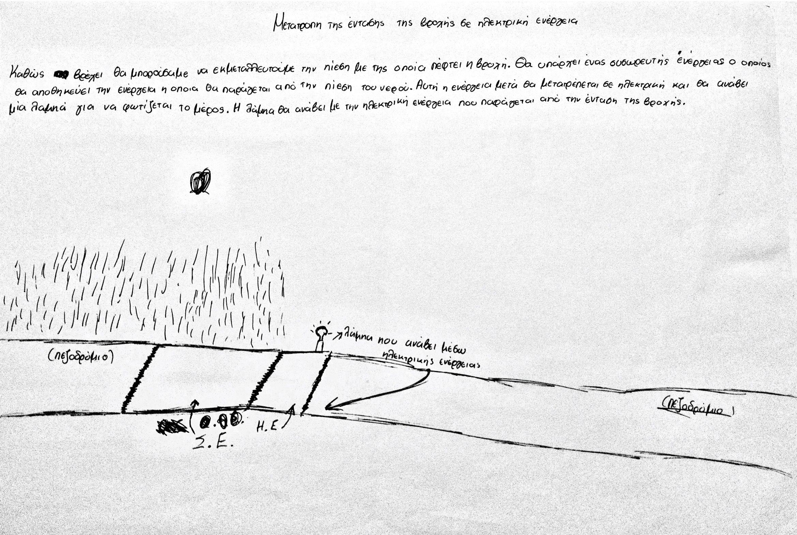

*Βροχή και ηλεκτρική ενέργεια - πρωτότυπο σχέδιο*

- **Βροχή - ηλεκτρική ενέργεια**: *"Θα μπορούσαμε να εκμεταλλευτούμε την πίεση με την οποία πέφτει η βροχή. Θα υπάρχει ένας συσσωρευτής ενέργειας ο οποίος θα αποθηκεύει την ενέργεια η οποία θα παράγεται από την πίεση του νερού. Αυτή η ενέργεια μετά, θα μετατρέπεται σε ηλεκτρική και θα ανάβει μία λάμπα για να φωτίζεται το μέρος. Η λάμπα θα ανάβει με την ηλεκτρική ενέργεια που παράγεται από την ένταση της βροχής.*

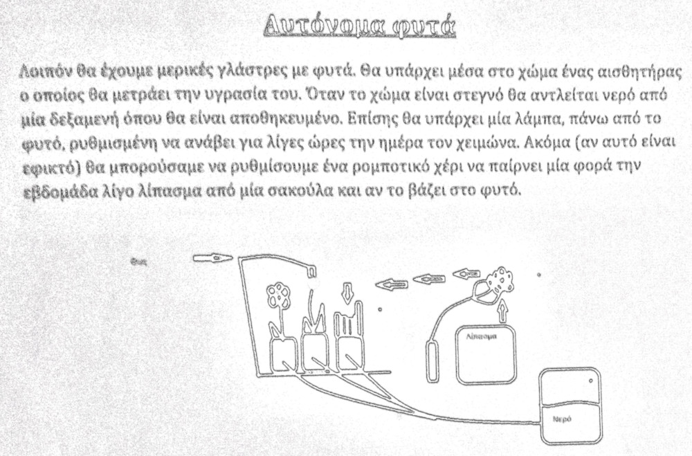

*Αυτόνομα φυτά - πρωτότυπο σχέδιο*

- **Αυτόνομα φυτά**: *"Θα έχουμε μερικές γλάστρες με φυτά. Θα υπάρχει μέσα στο χώμα ένας αισθητήρας ο οποίος θα μετράει την υγρασία του. Όταν το χώμα είναι στεγνό θα αντλείται νερό από μία δεξαμενή όπου θα είναι αποθηκευμένο. Επίσης θα υπάρχει μία λάμπα πάνω από το φυτό, ρυθμισμένη να ανάβει για λίγες ώρες την ημέρα το χειμώνα. Ακόμα (αν αυτό είναι εφικτό) θα μπορούσαμε να ρυθμίσουμε ένα ρομποτικό χέρι να παίρνει μία φορά την εβδομάδα λίγο λίπασμα από μία σακούλα και να το βάζεις στο φυτό."*

- **ΙΔΕΑ 1**: *"Μία ωραία ιδέα πιστεύω πως θα ήταν η δημιουργία μίας εφαρμογής στην οποία θα απεικονιζόταν ένας χάρτης της πόλης του χρήστη, πάνω στον οποίο θα αναγράφονταν όλα τα σημεία με φυσικές σκιές και πράσινα πάρκα για να ξαποστάσουν οι κάτοικοι. Επίσης, στην εφαρμογή αυτή θα μπορούσαν οι χρήστες να αναφέρουν διάφορα προβλήματα σε σχέση με το περιβάλλον, τα οποία οι αρμόδιοι του Δήμου θα αναλάμβαναν να αποκαταστήσουν. Συνεπώς, αυτή η εφαρμογή θα είχε σκοπό τόσο την παροχή βοήθειας στους πολίτες, όσο και την αποκατάσταση του περιβάλλοντος."*
- **ΙΔΕΑ 2**: *"Μια άλλη ιδέα θα ήταν η εγκατάσταση φωτοβολταϊκών στην οροφή λεωφορείων με σκοπό την εκμετάλλευση της ηλιακής ενέργειας για τις ανάγκες του κλιματισμού/φωτισμού. Αν όχι αποκλειστικά, τότε τουλάχιστον ένα μέρος της ενέργειας που απαιτείται για αυτό τον σκοπό, θα οφειλόταν στην ηλιακή ενέργεια και έτσι θα μπορούσαμε να προστατέψουμε το περιβάλλον και να περιορίσουμε την χρήση άλλων πόρων για την κάλυψη αυτών των αναγκών."*
- **ΙΔΕΑ 3**: *"Μια επιπλέον ιδέα θα ήταν η εγκατάσταση φωτοβολταϊκών στην οροφή σχολείων με σκοπό την εκμετάλλευση της ηλιακής ενέργειας για τις ανάγκες της σχολικής μονάδας. Το ηλεκτρικό κουδούνι, τα φώτα, ο κλιματισμός κλπ… θα λειτουργούσαν με ηλεκτρική ενέργεια που θα προέκυπτε από την ηλιακή ακτινοβολία. Με αυτόν τον τρόπο, θα μπορούσαμε να προστατέψουμε το περιβάλλον και να περιορίσουμε την χρήση άλλων πόρων για την κάλυψη αυτών των αναγκών."*
- **ΙΔΕΑ 4**: *"Επιπρόσθετα, με την χρήση ενός αισθητήρα ήχου και ένα μηχανισμό θα μπορούσαμε να ανοιγοκλείνουμε μια πόρτα, ή κάποιο ντουλάπι προφέροντας μια λέξη που αναγνωρίζει ο υπολογιστής και με την οποία τίθεται σε λειτουργία ο μηχανισμός."*
- **ΙΔΕΑ 5**: *"Επίσης, στο πάτο ενός κάδου απορριμμάτων θα μπορούσε να τοποθετηθεί ένας «πολτοποιητής». Με την χρήση ενός αισθητήρα χώρου/στάθμης, η λειτουργία του οποίου θα στηρίζεται στην ηλιακή ενέργεια, θα ελέγχεται ο χώρος που καταλαμβάνουν τα απορρίμματα. Όταν αυτά φτάνουν σε ένα συγκεκριμένο ύψος, ο «πολτοποιητής» θα τίθεται σε λειτουργία μειώνοντας τον όγκο τους στον κάδο. Συνεπώς, τα απορρίμματα θα μεταφέρονται σε πιο μεγάλα διαστήματα και με μεγαλύτερη ευκολία , ενώ θα εξοικονομούνται μεγάλα ποσά χρημάτων που ξοδεύονται στην προμήθεια καυσίμων για τα  απορριμματοφόρα."*

### Αναλυτική περιγραφή της ιδέας ###
Η ιδέα που τελικά επικράτησε είναι το ρομπότ *Wheεl Alert*. Στο παρακάτω κείμενο περιγράφεται η λειτουργία του:
- **Whell Alert**: *"Σε μία ράμπα αναπήρων βρίσκονται εγκατεστημένοι δύο ή τέσσερις αισθητήρες. Όταν ένα αυτοκίνητο σταθμεύει μπροστά στη ράμπα οι αισθητήρες ενεργοποιούν ένα σύστημα αντίστροφης μέτρησης της στάθμευσης (1,5 με 2 λεπτά). Αν περάσει ο χρόνος και το αυτοκίνητο βρίσκεται ακόμα σταθμευμένο ενεργοποιείται ένα σύστημα συναγερμού. Παράλληλα στέλνεται μήνυμα στην τροχαία."*

Το ρομπότ σχεδιάστηκε ως μακέτα ενός τμήματος δρόμου - πεζοδρομίου, εντός του αστικού περιβάλλοντος. Στη μακέτα περιλαμβάνεται ένα δάπεδο ήπιας κλήσης για ΑΜΕΑ. Στο πεζοδρόμιο, τριγύρω του, έχουν εγκατασταθεί αισθητήρες υπολογισμού απόστασης για τον εντοπισμό παράνομης στάθμευσης. Αν κάτι τέτοιο συμβεί και διαρκέσει περισσότερο από έναν προκαθορισμένο χρόνο, τότε το ρομπότ παράγει έναν οξύ ήχο συναγερμού. Ο ήχος προειδοποιεί για επερχόμενο πρόστιμο, οπότε το ρομπότ έχει αποτρεπτικό χαρακτήρα για τον οδηγό που δε θα έχει απομακρυνθεί. Υπάρχει η δυνατότητα να κληθεί και η Τροχαία για να διευθετήσει την κατάσταση. Το ρομπότ λειτουργεί σε ώρες που δεν ανήκουν στην περίοδο κοινής ησυχίας.

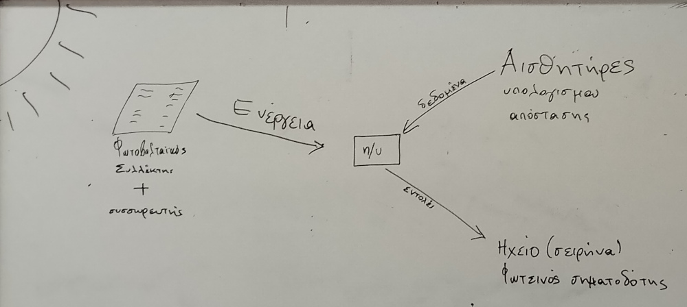

*Αρχική σχεδίαση του Wheel Alert*

Ιδιαίτερη προσοχή δόθηκε στο σύστημα παροχής ενέργειας. Σχεδιάστηκε με βάση τις σημαντικότερες αρχές της πράσινης οικονομίας. Βασίζεται σε ανανεώσιμες πηγές ενέργειας και η λειτουργία του έχει μηδενικό αποτύπωμα CO2. Το ρομπότ καλύπτει τις ενεργειακές του ανάγκες με τη βοήθεια ενός ηλιακού συλλέκτη. Όταν υπάρχει περίσσια ενέργειας, τότε αυτή αποθηκεύεται σε ένα συσσωρευτή, για μελλοντική χρήση.

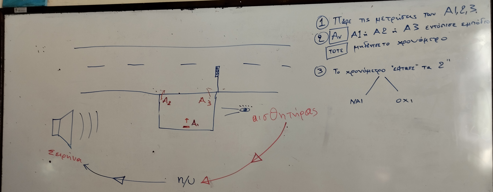

*Αρχική σχεδίαση του Wheel Alert*

Η σχεδίαση του ρομπότ επέλεξε υλικό και λογισμικό ανοιχτής αρχιτεκτονικής. Στη μακέτα χρησιμοποιούνται δύο αισθητήρες υπερύθρων οι οποίοι καλύπτουν το χώρο του δαπέδου ήπιας κλήσης. Εάν κάποιος από αυτούς εντοπίσει όχημα που καλύπτει την είσοδο - έξοδο στο δάπεδο ή βρίσκεται επάνω στο δάπεδο, τίθεται σε λειτουργία ο ενεργοποιητής του ρομπότ, που είναι μια σειρήνα. Υπάρχει και η δυνατότητα για μελλοντική εγκατάσταση συστήματος ειδοποίησης της Τροχαίας. Τα κύρια τμήματα του ρομπότ *Wheel Alert* είναι:
1. ρομποτικός ελεγκτής Arduino,
2. δύο αισθητήρες υπερύθρων,
3. ηλιακός συλλέκτης, συσσωρευτής και σύστημα διαχείρισης της ηλεκτρικής ενέργειας και
4. πρωτότυπη μακέτα πεζοδρομίου με δάπεδο ήπιας κλήσης

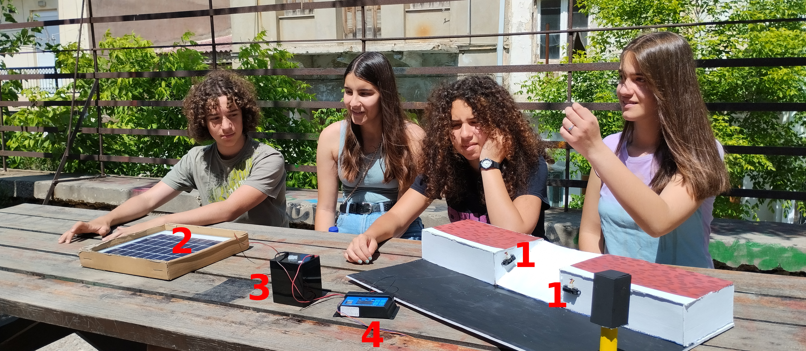

*Το πρωτότυπο ρομπότ binBot, σχεδιασμένο και κατασκευασμένο από την ομάδα του 2ου Γυμνασίου Χανίων. (1) υπέρυθροι αισθητήρες υπολογισμού απόστασης - χρησιμοποιούνται για τον εντοπισμό παράνομα σταθμευμένου οχήματος. (2) ηλιακός συλλέκτης, (3) συσσωρευτής ηλεκτρικής ενέργειας 12 V, (4) φορτιστής. Ο ρομποτικός ελεγκτής Arduino Uno rev3 έχει τοποθετηθεί στο εσωτερικό της μακέτας και δε διακρίνεται στη φωτογραφία*

### Βίντεο ###
Στο παρακάτω βίντεο υπάρχει μια αναλυτική περιγραφή των λειτουργιών του *Wheel Alert*:
- [Παρουσίαση του ρομπότ Wheel Alert](https://youtu.be/OqgLDhspYeY)

### Λίστα εξοπλισμού ###
1. [Ρομποτικός ελεγκτής arduino Uno](https://grobotronics.com/solenoid-12v-jf-0826b.html) - 16€,
2. [Αισθητήρες υπερύθρων](https://grobotronics.com/relay-module-4-channel.html) - 6€,
3. [Ηλιακός συλλέκτης](https://grobotronics.com/infrared-proximity-sensor-short-range-sharp-gp2y0a41sk0f.html) - 24€,
4. [συσσωρευτής](https://grobotronics.com/arduino-uno-rev3.html) - 22€,
5. [φορτιστής]() = €
5. δοχείο απορριμάτων και σχετικές κατασκευές στήριξής τους (40€) και
6. καλώδια διάφορων ειδών και πλακέτες δοκιμών (20€).

### Ενδεικτικό κόστος ###
Εντός των παρενθέσεων στη λίστα προτεινόμενου εξοπλισμού αναφέρεται το ενδεικτικό κόστος για το κάθε εξάρτημα του ρομπότ. Το συνολικό κόστος περιορίστηκε στα **125€**.

### Πρωτοτυπία λύσης ###
Μετά από έρευνα που κάναμε στο διαδίκτυο συνειδητοποιήσαμε ότι δεν έχει ασχοληθεί κάποια ομάδα με αυτό το θέμα. Στην πόλη μας δεν υπάρχει κάποια ανάλογη κατασκευή παρά το γεγονός ότι υπάρχει ιδιαίτερα οξύ πρόβλημα στάθμευσης. Η ιδέα μας θα βελτιώσει την καθημερινότητα των ΑΜΕΑ αλλά και όλων των πολιτών. Ευελπιστούμε να αλλάξει και τη συμπεριφορά των ασυνείδητων οδηγών.

## Υλοποίηση της ιδέας ##
Όλες οι σχετικές κατασκευές πραγματοποιήθηκαν στο εργαστήριο του 2ου Γυμνασίου Χανίων. Δεν απαιτήθηκε η χρήση εξειδικευμένων εργαλείων ή κατεργασιών κατά τη συναρμολόγηση των εξαρτημάτων.

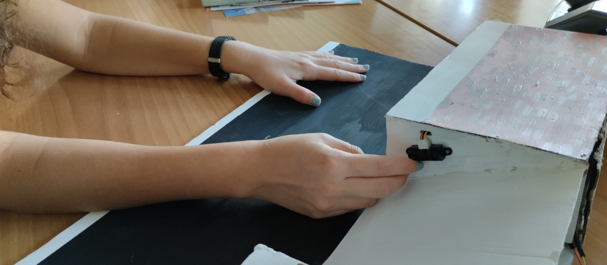

*Τοποθέτηση του αισθητήρα υπερύθρων*

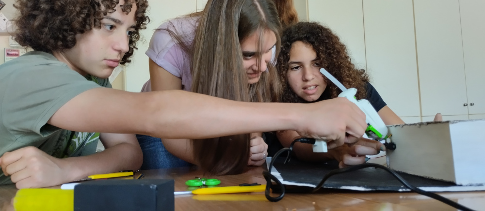

*Στιγμιότυπα από τις εργασίες της ομάδας κατά την κατασκευή του ρομπότ*

### Προγραμματισμός ###
Αρχικά έγινε ο σχεδιασμός και η ανάλυση του αλγορίθμου σε φυσική γλώσσα. Αφού ελέγχθηκε και σχεδιάστηκε σε ένα διάγραμμα ροής, αναπτύχθηκε το πρόγραμμα με τη βοήθεια του προγραμματιστικού περιβάλλοντος Arduino IDE.

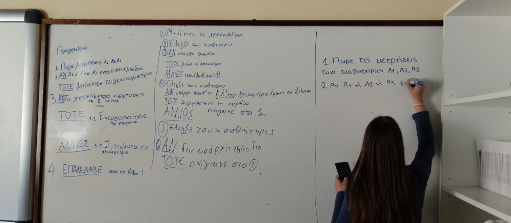

*Σύνταξη του αλγορίθμου - αρχικές ιδέες*

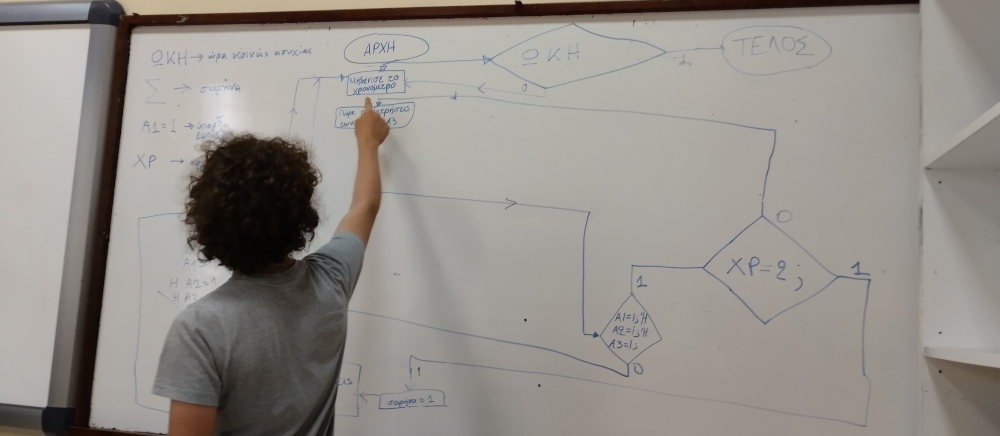

*Σύνταξη του αλγορίθμου - σχεδίαση του διαγράμματος ροής*

*Σύνταξη του αλγορίθμου - το διάγραμμα ροής*

Το πρόγραμμα που αναπτύχθηκε είναι διαθέσιμο στο αποθετήριο, με το όνομα [wheel_alert.ino](schediasi/logismiko/arduino_programs/BinBot/BinBot.ino).

### Μηχανισμοί και ηλεκτρονικά ###

Το πρωτότυπο ρομπότ binBot κατασκευάστηκε το Μάιο και τον Ιούνιο του 2022 από την ομάδα του 2ου Γυμνασίου Χανίων. Χρησιμοποιήθηκαν κοινά εργαλεία και υλικά για γρήγορη πρωτοτυποποίηση, όπως χαρτόνια και κόλλες. Το τελικό αποτέλεσμα της κατασκευής, καθώς και τα επιμέρους εξαρτήματα του ρομπότ φαίνονται στις φωτογραφίες παρακάτω. Ο απαιτούμενος ηλεκτρονικός εξοπλισμός αγοράστηκε υπό την αιγίδα του διαγωνισμού και τοποθετήθηκε στο ρομπότ χρησιμοποιώντας τεχνικές γρήγορης και εύκολης συναρμολόγησης και πρωτοτυποποίησης.

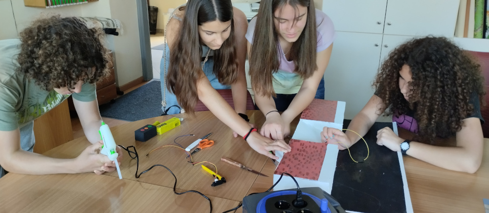
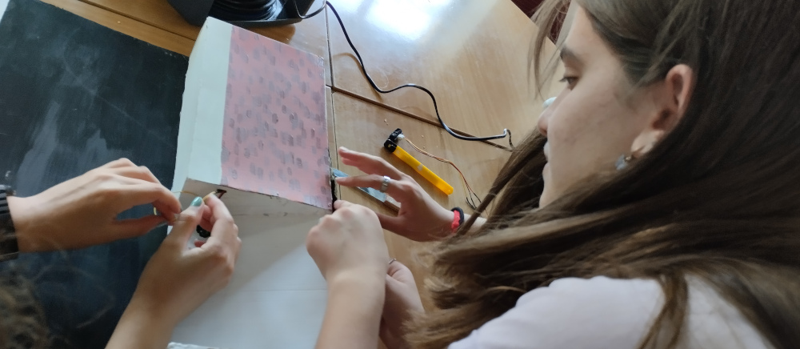

*Κατασκευή του πρωτότυπου ρομπότ Wheel Alert στο 2ο Γυμνάσιο Χανίων.*

# Εκπαιδευτικό υλικό, περιεχόμενο και παρουσίαση #
## Αποθετήριο στο github ##
Για την υποστήριξη της εργασίας δημιουργήθηκε ένα αποθετήριο στο github, στην παρακάτω διεύθυνση:
- [https://github.com/2o-gymnasio-chania/2023_openedtech_competition](https://github.com/2o-gymnasio-chania/2023_openedtech_competition)

Το αποθετήριο περιλαμβάνει την πλήρη περιγραφή του ρομπότ, το πρόγραμμα του και όλο το συνοδευτικό υλικό από τη διαδικασία της σχεδίασης και της κατασκευής.

## Ιστοσελίδα στο robotics.ellak και φωτογραφίες ##
Για την υποστήριξη της εργασίας δημιουργήθηκε η παρακάτω ιστοσελίδα στο robotics.ellak:
- ςςςςςςςςςςςςςςςςςςςςςςςςςςςςςςςς ςςςςςς

Στην ιστοσελίδα υπάρχει παρουσίαση με σχέδια και φωτογραφίες από τη διαδικασία σχεδίασης και κατασκευής του ρομπότ.

## Σχέδια μαθήματος/Παραγωγή ενός σχέδιο ανοιχτού εκπαιδευτικού πόρου σύμφωνα με το OER ##

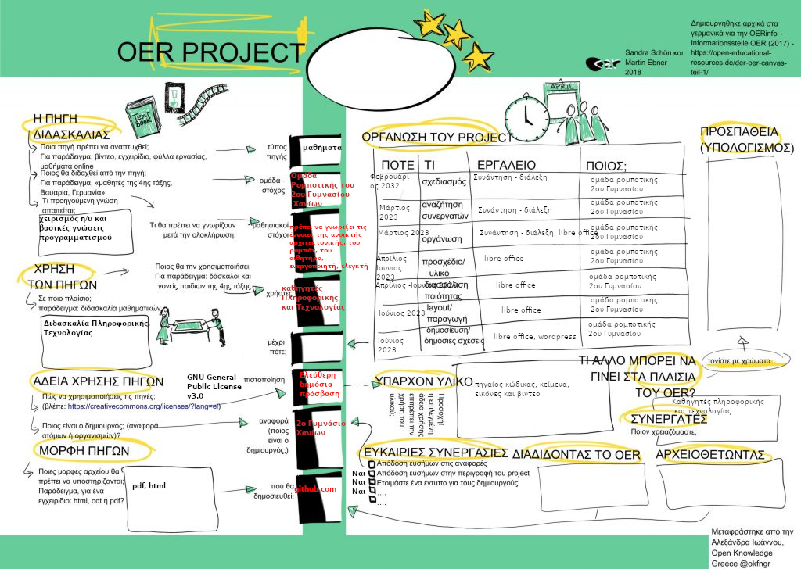

*Σχέδιο ανοιχτού εκπαιδευτικού πόρου σύμφωνα με το OER*

Στο πλαίσιο του διαγωνισμού αναπτύχθηκε ένα [σχέδιο ανοιχτού εκπαιδευτικού πόρου](https://oer.ellak.gr/2018/03/02/oer-canvas-to-protipo-gia-tin-dimiourgia-anichton-ekpedeftikon-poron-ke-sta-ellinika/) - Open Educational Resources (OER). Το σχέδιo είναι διαθέσιμο στο αποθετήριο της ομάδας:
- [https://github.com/2o-gymnasio-chania/2022_openedtech_competition/blob/main/OER_canvas/OER_canvas_binBot.png](https://github.com/2o-gymnasio-chania/2022_openedtech_competition/blob/main/OER_canvas/OER_canvas_binBot.png)

## Άδειες χρήσης, για άδειες λογισμικού και περιεχομένου ##
Η άδεια χρήση που επιλέχθηκε για το έργο της ομάδας είναι η [GNU General Public License v3.0](https://github.com/2o-gymnasio-chania/2021_openedtech_competition/blob/main/LICENSE).

