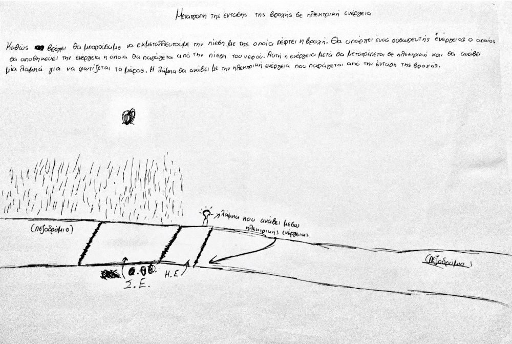

# 2ο Γυμνάσιο Χανίων - 5oς Πανελλήνιος Διαγωνισμός Ανοιχτών Τεχνολογιών

## Wheel Alert - ρομπότ επιτήρησης των δαπέδων ήπιας κλήσης για ΑΜΕΑ

## Έρευνα και σχεδίαση ##

### Αρχική ιδέα

*Η ομάδα ρομποτικής του 2ου Γυμνασίου Χανίων και το πρωτότυπο ρομπότ Wheel Alert.*

Μια από τις ιδέες πριν τη σχεδίαση του ρομπότ περιγράφεται από το παρακάτω κείμενο μαθητή, μέλους της ομάδας Ρομποτικής του 2ου Γυμνασίου Χανίων:

*"Σε μία ράμπα αναπήρων βρίσκονται εγκατεστημένοι δύο ή τέσσερις αισθητήρες. Όταν ένα αυτοκίνητο σταθμεύει μπροστά στη ράμπα οι αισθητήρες ενεργοποιούν ένα σύστημα αντίστροφης μέτρησης της στάθμευσης (1,5 με 2 λεπτά). Αν περάσει ο χρόνος και το αυτοκίνητο βρίσκεται ακόμα σταθμευμένο ενεργοποιείται ένα σύστημα συναγερμού. Παράλληλα στέλνεται μήνυμα στην τροχαία."*

Το ρομποτικό σύστημα Wheel Alert θα είναι ενεργειακά αυτόνομο και σύμφωνο με τους όρους της Πράσινης Οικονομίας Ανοιχτής και Ίσης για Όλους, καθώς θα διαθέτει ηλιακό συλλέκτη, συσσωρευτή ηλεκτρικής ενέργειας και σύστημα διαχείρισης της ηλεκτρικής ενέργειας.

### Πράσινη οικονομία, Ανοιχτή και Ίση για Όλους
 Η ιδέα του *Wheel Alert* καλύπτει τη θεματική κατηγορία του διαγωνισμού επειδή σχετίζεται με:
* εξοικονόμηση ενέργειας (σύστημα διαχείρισης ηλεκτρικής ενέργειας του Wheel Alert),
* ενίσχυση της κοινωνικής ισότητας (διευκόλυνση της καθημερινότητας των ΑΜΕΑ),
* πράσινη παραγωγή ενέργειας (ηλιακός συλλέκτης του Wheel Alert),
* μέσα μεταφοράς (το ρομπότ αφορά δάπεδα απαλής κλήσης για ΑΜΕΑ και οχήματα πόλης),
* πράσινη μετακίνηση (το ρομπότ αφορά δάπεδα απαλής κλήσης για ΑΜΕΑ και οχήματα πόλης) και
* πράσινη κουλτούρα και κοινωνική ευαισθησία (ηλιακή ενέργεια και διαφύλαξη των δικαιωμάτων των ΑΜΕΑ).

Εντός των παρενθέσεων αναφέρονται η σχέση με τα εξαρτήματα και τις δυνατότητες του ρομπότ.

### Ανοιχτή αρχιτεκτονική
Για την κατασκευή του ρομπότ χρησιμοποιήθηκαν, αποκλειστικά, λογισμικό και υλικό ανοιχτής αρχιτεκτονικής: 
- ο ελεγκτής του ρομπότ είναι ο διάσημος Arduino Uno.
- Το λογισμικό του ρομπότ αναπτύχθηκε με τη βοήθεια του προγραμματιστικού περιβάλλοντος Arduino IDE.

Τα σχέδια, ο αλγόριθμος, το πρόγραμμα και όλο το σχετικό υλικό του *Wheel Alert* διανέμονται με την άδεια ανοιχτής αρχιτεκτονικής *GPL-3.0*.

### Μελέτη υπάρχουσας κατάστασης ###

*Προβληματισμοί κατά την αρχική φάση της σχεδίασης*

Τις σύγχρονες Ελληνικές πόλεις βασανίζει το πρόβλημα της παράνομης στάθμευσης. Το πρόβλημα αυτό επηρεάζει αρνητικά την καθημερινότητα των ΑΜΕΑ στο αστικό περιβάλλον. Μια από τις συνήθεις μορφές του προβλήματος είναι η παράνομη στάθμευση οχημάτων στα δάπεδα ήπιας κλήσης. Ως αποτέλεσμα της παράνομης αυτής συνήθειας των οδηγών προκύπτει η αδυναμία πρόσβασης των ΑΜΕΑ και ιδιαίτερα των ανθρώπων που κινούνται σε αμαξίδιο, στα πεζοδρόμια και στις συνήθεις διαδρομές στο κέντρο των πόλεων. Το πρόβλημα, κυρίως,  οφείλεται στην ελλειπή εκπαίδευση των οδηγών και στην ελλιπή αστυνόμευση. Το ρομπότ *Wheel Alert* θα προσπαθήσει να μετριάσει το πρόβλημα της ελλιπούς επιτήρησης και αστυνόμευσης. Είναι κατάλληλα κατασκευασμένο και προγραμματισμένο ώστε να επιτηρεί την περιοχή του διαδρόμου ήπιας κλήσης. Με ένα κόστος κατασκευής περίπου στα 100€, το *Wheel Alert* αντικαθιστά αξιόπιστα την ανθρώπινη επίβλεψη χωρίς κόστος λειτουργίας. Παράγει έναν οξύ και ενοχλητικό ήχο, όποτε ένα όχημα εμποδίζει την κίνηση στα δάπεδα ήπιας κλήσης. Έτσι θα στιγματίζει τον ασυνείδητο οδηγό και θα προκαλεί το κοινό αίσθημα στους παρευρισκόμενους πολίτες. Στοχεύεται έτσι η ευαισθητοποίηση τόσο των οδηγών των οχηματων, όσο και των πεζών, που με αφορμή τους ήχους του ρομπότ μπορεί να αποτρέψουν την παράνομη στάθμευση με πιθανές επεμβάσεις τους και συμβουλές προς τους οδηγούς.

### Ορισμός του προβλήματος ###
Με τη βοήθεια του ρομπότ *Wheel Alert* μπορούν να αντιμετωπιστούν τα παρακάτω προβλήματα:
- παράνομη στάθμευση
- εμπόδια στην κίνηση των ΑΜΕΑ εντός του αστικού περιβάλλοντος
- αποδοτική διαχείριση της ενέργειας
- ρυπογόνος ενέργεια

### Εναλλακτικές προτάσεις ###
Το 2ο Γυμνάσιο Χανίων συμμετέχει στον 5ο διαγωνισμό με τη θεμαική κατηγορία *Πράσινη οικονομία, Ανοιχτή και Ίση για Όλους*. Αρχικά υπήρχε έντονος προβληματισμός στην ομάδα για την επιλογή του θέματος και της ιδέας που θα οδηγούσε στην κατασκευή του ρομπότ. Η φαντασία των μελών της ομάδας και η εμπειρία της από τις συμμετοχές στους προηγούμενους διαγωνισμούς στήριξαν την υποβολή πολλών εναλλακτικών προτάσεων, με πολύ ενδιαφέρουσες δυνατότητες που σχετίζονται με την πράσινη οικονομία. Στο παρακάτω κείμενο αναφέρονται οι εναλλακτικές ιδέες, αντιγράφοντας ακριβώς τα κείμενα όπως τα καταθέσαν οι μαθήτριες και οι μαθητές.
- **Τριβή**: *"Η εγκατάσταση αυτή εκμεταλλεύεται την τριβή που δημιουργείται από τα αυτοκίνητα. Τοποθετημένη σε ένα κεντρικό δρόμο μπροστά από μία στάση λεωφορείων, τα αυτοκίνητα περνάνε από πάνω της και δημιουργείται τριβή και συσσωρεύεται θερμική ενέργεια. Αυτή η ενέργεια μετατρέπεται από έναν συλλέκτη ενέργειας στην άκρη του δρόμου. Έτσι, μία μεγάλη ποσότητα ενέργειας μπορεί να χρησιμοποιηθεί για να τροφοδοτηθούν πολλές συσκευές μέσω φορτιστών οι οποίοι θα είναι τοποθετημένοι στη στάση."*

*Παπούτσια που λειτουργούν ως φορτιστής*

- **Παπούτσια φορτιστής**: *Παπούτσι που φορτίζει μπαταρίες μέσω οριζόντιας κίνησης δηλαδή με το περπάτημα.*
- **Μετατροπέας της δύναμης του νερού σε ηλεκτρική ενέργεια**: *"Εάν μπορούσαμε να μετατρέψουμε τη δύναμη με την οποία πέφτει το νερό σε ηλεκτρική ενέργεια τότε θα μπορούσαμε να εξοικονομήσουμε μεγάλη ποσότητα ηλεκτρισμού. Θα μπορούσαμε να κάνουμε ένα τεχνητό καταρράκτη και το νερό το οποίο θα πέφτει από ένα ύψος περίπου 10 με 15 μέτρα να καταλήγει σε έναν συλλέκτη ενέργειας και ηλεκτρική ενέργεια που θα δημιουργείται να χρησιμοποιείται για την απαραίτητη ηλεκτρική ενέργεια μιας περιοχής. Το νερό έπειτα θα μπορούσε να αποβάλλεται ή να συλλέγεται για άλλη χρήση."*

*Παπούτσια που λειτουργούν ως φορτιστής*

- **Βροχή - ηλεκτρική ενέργεια**: *"Θα μπορούσαμε να εκμεταλλευτούμε την πίεση με την οποία πέφτει η βροχή. Θα υπάρχει ένας συσσωρευτής ενέργειας ο οποίος θα αποθηκεύει την ενέργεια η οποία θα παράγεται από την πίεση του νερού. Αυτή η ενέργεια μετά, θα μετατρέπεται σε ηλεκτρική και θα ανάβει μία λάμπα για να φωτίζεται το μέρος. Η λάμπα θα ανάβει με την ηλεκτρική ενέργεια που παράγεται από την ένταση της βροχής.*

*Βροχή και ηλεκτρική ενέργεια*

Στο παρακάτω βίντεο υπάρχει μια αναλυτική περιγραφη των λειτουργιών του *Wheel Alert*:
- [Παρουσίαση του ρομπότ Wheel Alert](https://youtu.be/OqgLDhspYeY)

### Αναλυτική περιγραφή της ιδέας ###

